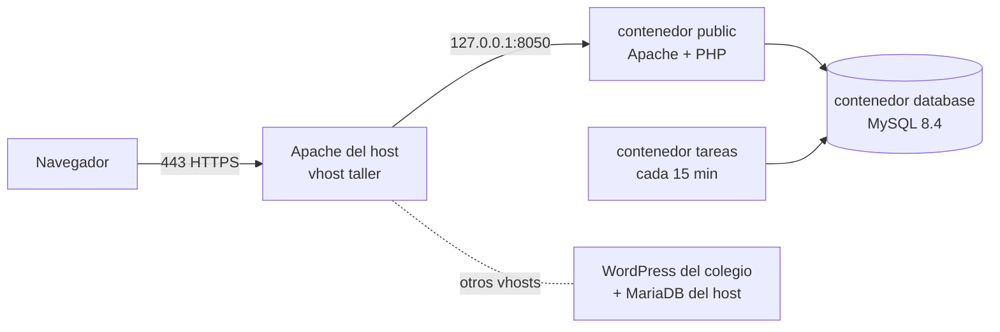

# Despliegue en producción

Cómo está instalado el sistema en el servidor y cómo se opera. Para levantarlo en una PC
de desarrollo, ver la *Puesta en marcha* del [README](README.md).

> El repositorio es **público**: acá no van claves, contraseñas ni el contenido del `.env`.
> Los pendientes que exponen puntos débiles del servidor van en `PENDIENTES.local.md`, que
> no se versiona.

**Estado:** en producción desde el 2026-10-05, con base vacía.

## Dónde está

| | |
| --- | --- |
| Dirección | <https://taller.pcfighter.com.ar> |
| Servidor | VPS Debian 13 · 2 núcleos · 3,8 GB de RAM · 2 GB de swap |
| DNS | FreeDNS (afraid.org): registro A `taller` → IP de la VPS |
| Certificado | Let's Encrypt con `certbot --apache`, se renueva solo |

La VPS **es compartida**: en el host corren el sitio WordPress de un colegio (Apache) y su
base MariaDB. El sistema del taller vive aparte, en Docker, y no comparte nada con ellos más
que el Apache que hace de proxy.



## Usuario y carpetas

Todo el proyecto pertenece al usuario de sistema **`abel`**:

- Sin contraseña (bloqueada) y sin `sudo`; no se puede entrar con él por SSH. Se usa desde
  el usuario administrador con `sudo -iu abel`.
- Está en el grupo `docker`, lo que en la práctica equivale a root: separa archivos y
  responsabilidades, no es una barrera de seguridad.
- Home en `/opt/abel` con permisos `750`. **Esto es lo que protege los datos**: el
  contenedor guarda `storage/` (fotos, configuración y backups con el volcado de la base)
  como `www-data`, que en el host es el usuario del Apache del colegio. Con `750`, el
  `www-data` del host no puede ni entrar a la carpeta.
- Código en `/opt/abel/abel_mecanica`, clonado por HTTPS desde `main`.

**No ponerle `umask 027` al usuario**: el contenedor lee el código como `www-data` y, con
ese umask, Apache daría 403. La protección la da `/opt/abel`; adentro, permisos normales.

## Contenedores

Se levantan tres de los cuatro servicios del `docker-compose.yml`:

| Servicio | Qué es | En producción |
| --- | --- | --- |
| `database` | MySQL 8.4 | ✅ siempre, en `127.0.0.1:8807` |
| `public` | La aplicación (Apache + PHP) | ✅ siempre, en `127.0.0.1:8050` |
| `tareas` | Recordatorios, avisos y backup diario | ✅ siempre |
| `admin` | phpMyAdmin | ❌ solo cuando hace falta |

Los tres puertos escuchan solo en `127.0.0.1`: desde internet se entra únicamente por el
Apache del host, con HTTPS. Docker abre los puertos publicados por encima de `ufw`, así que
esto no se puede delegar en el firewall.

Docker se instaló desde el repositorio oficial, con rotación de logs en
`/etc/docker/daemon.json` (`max-size` 10m, `max-file` 3) para que no llenen el disco.

## `.env` de producción

Se armó desde `.env.example` con `chmod 600`. Diferencias con el ejemplo:

| Variable | Valor |
| --- | --- |
| `APP_URL` | `https://taller.pcfighter.com.ar` |
| `TRUSTED_PROXIES` | `172.16.0.0/12` — el Apache del host llega al contenedor desde el gateway de la red de Docker |
| `DB_PASSWORD`, `MYSQL_ROOT_PASSWORD` | Generadas al azar con `openssl rand -hex 24` |
| `MAIL_DSN`, `MAIL_FROM` | Cuenta de Gmail con contraseña de aplicación |

`DB_PORT` queda en `3306`: la aplicación se conecta a MySQL por la red interna de Docker. El
`8807` es solo el puerto publicado en el host.

## Proxy de Apache

`/etc/apache2/sites-available/taller.conf` (módulos `proxy`, `proxy_http` y `headers`):

```apache
<VirtualHost *:80>
    ServerName taller.pcfighter.com.ar
    ProxyPreserveHost On
    RequestHeader set X-Forwarded-Proto expr=%{REQUEST_SCHEME}
    ProxyPass        / http://127.0.0.1:8050/
    ProxyPassReverse / http://127.0.0.1:8050/
</VirtualHost>
```

`certbot --apache` generó `taller-le-ssl.conf` y la redirección de HTTP a HTTPS.

**No apuntar otros nombres del dominio a esta VPS sin su propio vhost**: Apache le sirve a
un nombre desconocido el primer sitio que tiene, que es el del colegio.

## Operación

Todos los comandos, como `abel` y parado en `~/abel_mecanica` (`sudo -iu abel`, después
`cd ~/abel_mecanica`).

**Actualizar** después de subir cambios a `main` (las migraciones se aplican solas):

```bash
git pull
docker compose up -d --build database public tareas
```

**Estado y logs:**

```bash
docker compose ps
docker compose logs public --tail 50
```

**phpMyAdmin**, por túnel SSH desde la PC:

```bash
docker compose up -d admin            # en la VPS
ssh -L 8051:localhost:8051 <usuario>@taller.pcfighter.com.ar   # en la PC → http://localhost:8051
docker compose stop admin             # al terminar
```

**Contraseña olvidada del administrador:**

```bash
docker compose exec public php bin/usuario.php clave <usuario>
```

**Probar que responde** (un `HEAD` con `curl -I` también sirve: se atiende como `GET`):

```bash
curl -s -o /dev/null -w '%{http_code}\n' https://taller.pcfighter.com.ar/   # 303 = OK
```

## Pendientes

| # | Qué | Prioridad |
| --- | --- | --- |
| 1 | **Copia de los backups fuera de la VPS.** Hoy quedan solo en `storage/backups`, en el mismo disco: si se pierde el servidor, se pierde todo junto. El mecanismo ya existe (`BACKUP_COPIA_DIR` + `docker-compose.override.yml`, ver *Backups* en el README); falta decidir el destino (Drive con rclone, la PC del taller, otra VPS). | Alta |
| 2 | **Cuenta de email propia del taller.** Hoy los avisos salen de una cuenta personal de Gmail: los clientes ven ese remitente y Gmail limita a unos 500 envíos por día. | Media |
| 3 | **Monitor de disponibilidad** externo (UptimeRobot y similares). El router ya responde `HEAD`. | Baja |
